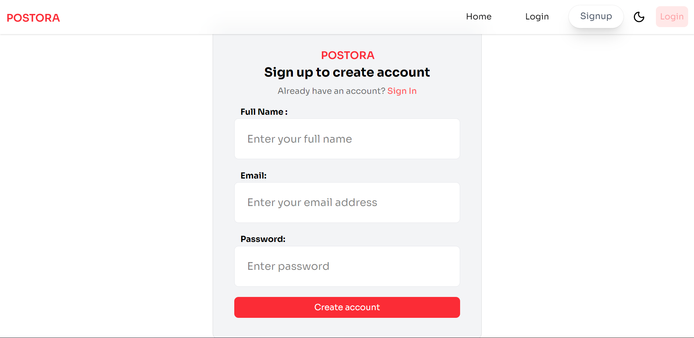
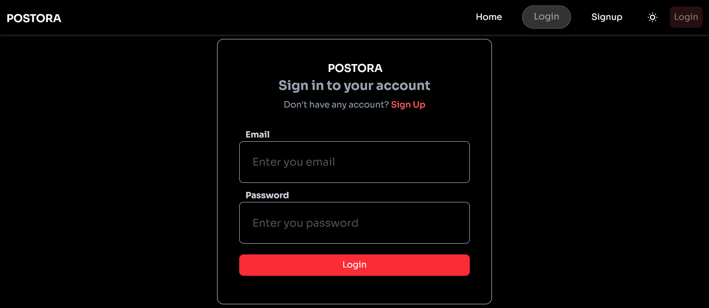
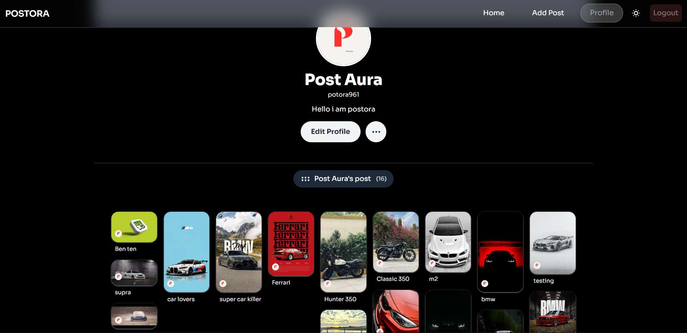
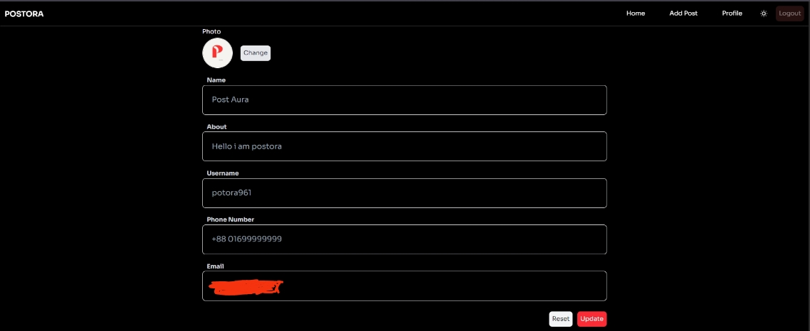
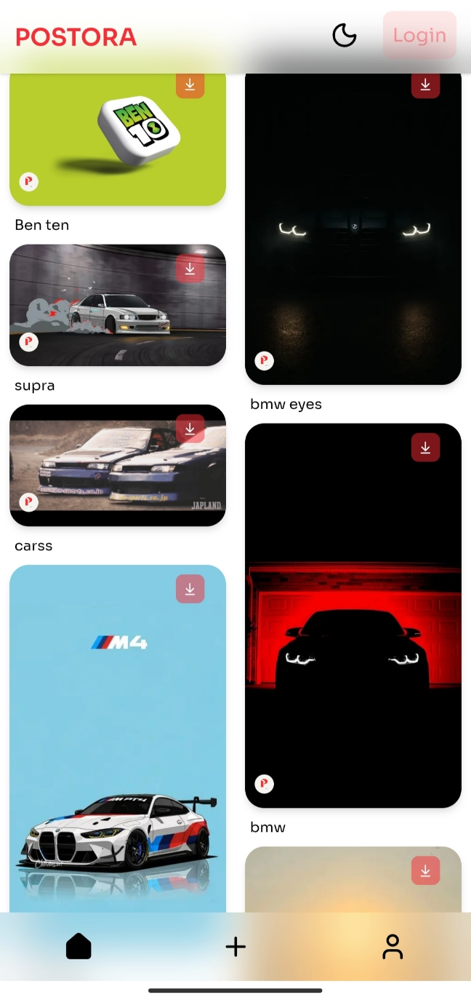
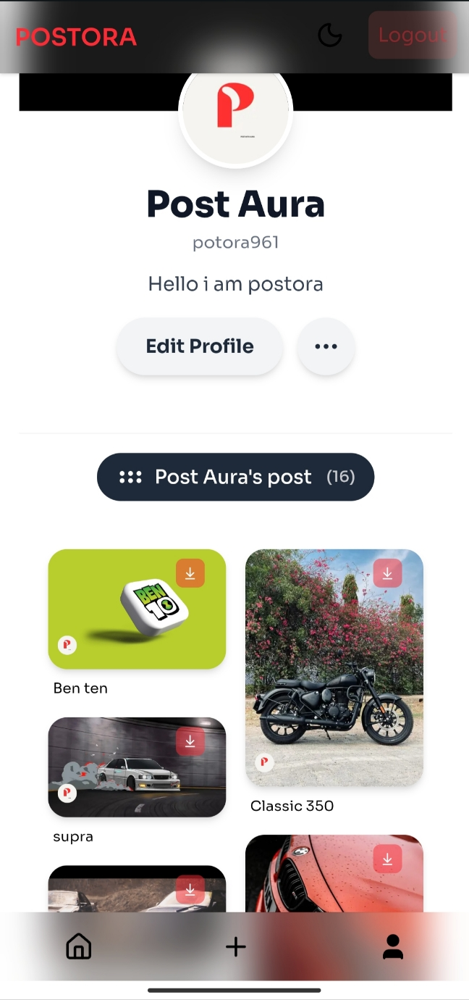
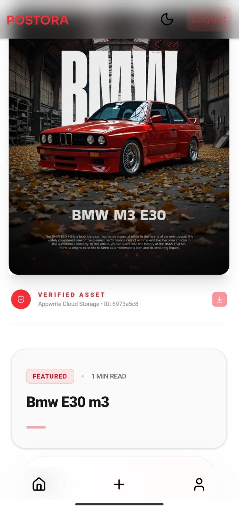

🎨 Image Sharing Platform

  

A full‑featured open‑source web app for image sharing built with Next.js (React) and Appwrite. It includes secure authentication, full CRUD operations, frontend validation, responsive UI, profile management, and a production‑ready setup.

🚀 Live Demo

👉 https://postora-web.vercel.app/

(Features may update over time.)

🧠 What This Project Is

This isn’t a basic example project. The app includes:

✔ User registration, login, logout
✔ Authenticated routes protected by Appwrite
✔ Uploading, editing, deleting images (CRUD)
✔ Real‑time display of images in a public feed
✔ Profile pages and user controls
✔ Frontend validation on all forms
✔ Responsive UI with modern design

This project is open source and extendable — perfect for learning or building on.

🧰 Tech Stack

        

🛠 Installation

Clone the repository

git clone https://github.com/Newton2n/image-sharing-platform.git
cd image-sharing-platform

Install dependencies

npm install

🤖Set Up Appwrite

Visit your Appwrite Console and create a new project.

Auth: Enable Email/Password authentication.

Database: Create a database named post.

Collections: Create two collections:

usersPost (for storing post data)

usersProfile (for user metadata)

Storage: Create a Bucket for images.

🔑 Appwrite API Key Configuration
Create a new API Key in your Appwrite Console (Integration > API Keys) and select the following scopes:

Databases:

row.read (Read rows)
row.write (Create, update, and delete rows)

Storage:

files.read (Read files and previews)
files.write (Create, update, and delete files)
.
Create a .env.local file in the root and add:
# Appwrite Public Config (Client-side)
NEXT_PUBLIC_APPWRITE_URL="" ,

NEXT_PUBLIC_APPWRITE_PROJECT_ID="" ,

NEXT_PUBLIC_APPWRITE_DATABASE_ID="" ,

NEXT_PUBLIC_APPWRITE_TABLE_ID="" ,

NEXT_PUBLIC_APPWRITE_USERS_PROFILE_INFORMATION_TABLE_ID="" ,

# Appwrite Secret Key (Server-side Only)
# WARNING: Do not prefix this with NEXT_PUBLIC_
NEXT_PUBLIC_APPWRITE_BUCKET_ID="" ,

# Editor Config
NEXT_PUBLIC_TINYMCE_API_KEY="";

💡 TinyMCE API Key

To integrate TinyMCE as your rich text editor, you need a Tiny Cloud API key:

Go to https://www.tiny.cloud/
 and create a free account.

On your Tiny Cloud dashboard, get your API key.

Add that key under NEXT_PUBLIC_TINYMCE_API_KEY in your .env.local.

This allows TinyMCE to load properly and prevents editor warnings.

Important: Do not commit sensitive API keys to your repository. Add .env* to .gitignore.

▶️ Running Locally

Start the development server:

npm run dev

Open http://localhost:3000
 in your browser.

📦 Usage

Once running:

✔ Register a new account
✔ Log in
✔ Upload images
✔ Edit or delete your posts
✔ View images from all users

All forms include frontend validation to prevent incorrect input.

📸 Screenshots
🖥 Desktop Views

  
  
  
  

  
  

### 📱 Mobile Views

  
  
  
  

(Include real file names that match your repo.)

Visuals help users and contributors quickly understand the app UI without running it locally.

🧑‍💻 How It Works

Auth: Appwrite handles user authentication securely.

Database: Appwrite stores posts and user metadata.

Storage: Image files are stored and served via Appwrite buckets.

UI: Tailwind CSS ensures a responsive, modern layout.

🛡 Contributing

Contributions are welcome! To contribute:

Fork the repository

Create a new branch (git checkout -b feature/xyz)

Make your changes

Push and open a pull request

This keeps the project healthy and evolving.

🧪 Testing

Testing isn’t included yet, but you could add:

✔ Unit tests (Jest, React Testing Library)
✔ API route tests
✔ CI workflows (GitHub Actions)

📦 Roadmap (Optional)

Ideas for future improvements:

✔ Comments and likes on images
✔ Notification system
✔ Pagination & search
✔ Real‑time updates (WebSockets)

📄 License

Distributed under the MIT License.
See the LICENSE file for details.
